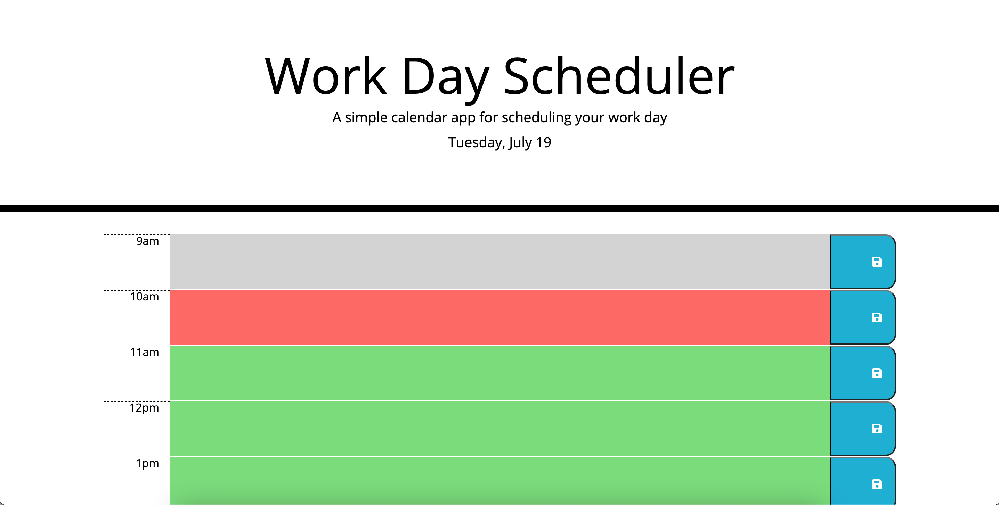
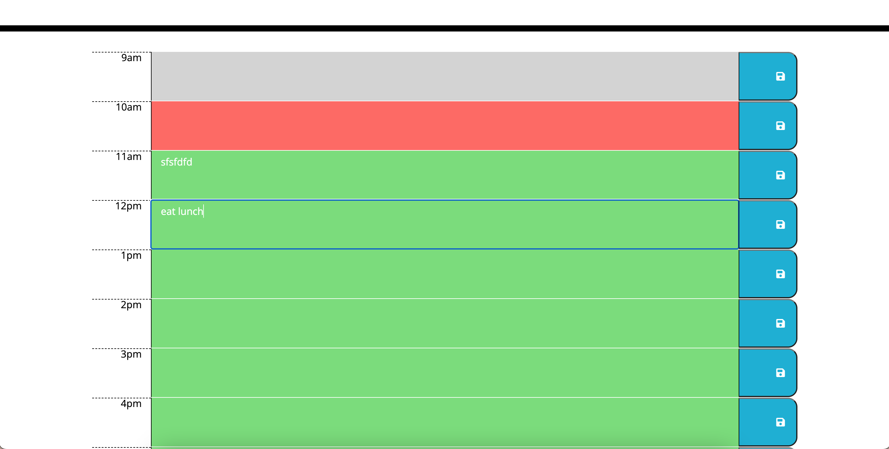

# ryan-green-work-day-scheduler

## Description

The challenge was to use started code to make a scheduler that lets you save a text input to different hours of the day. It also shows the current, past and future hours by color using day.js. Besides using day.js, I also used some jquery and got more practice with local storage and building an app using pre-made css.

## Installation

https://nuglah.github.io/ryan-green-work-day-scheduler/

## Usage

Shows the currents day at the top that will update live. Under that is time blocks for hours 9-5. With color codes to show if the time is past, present or future. Grey for past, red for present and green for future. When you enter something into the timeblock and click save it will stay even when you refresh the page.

